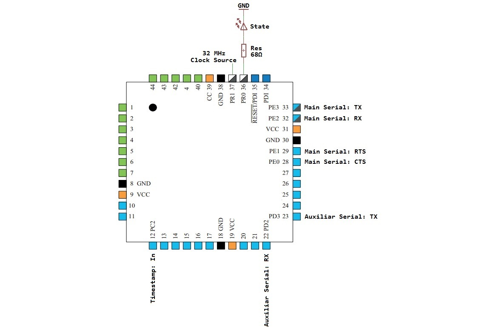

# Harp – Core Library for the ATxmega

Folder containing the source files for the library that implements Harp on the Atmel's ATxmega family of microcontrollers.

## What is the Core Library for the ATxmega?

It's a piece of code that implements the Harp infrastructure into the microcontroller.
The output is a library that is then included in each Harp device's project using Atmel Studio.

[ATxmega](http://www.atmel.com/products/microcontrollers/avr/avr_xmega.aspx) is a familly of microcontrollers provided by [Atmel](http://www.atmel.com/).

The main features are:

* Take care of the comunication with the computer (including Tx and Rx buffers)
* Implement the Harp protocol
* Implement the Common and User registers banks
* Manage the timestamp and synchronization
* Control the state LED
* Initialize and handle microcontroller's clock

## What can I find on this folder?

The source code to construct the Harp library for Atxmega

## What software do I need to view or open the files?

The code is developed on the [Atmel](http://www.atmel.com/)'s IDE with the name [Atmel Studio](http://www.atmel.com/tools/ATMELSTUDIO.aspx).

## How do I get set up? ###

### Compile the Harp Core

1. Install the Atmel Studio.
2. Open the solution named **Core.atsln** on the folder **Firmware**.
3. To compile, use the command **Build > Rebuild Solution** (that can be issued using the shortcut Ctrl+Alt+F7).
4. The output library (files with extension **.a**) can be found on the folder **Firmware\Core\Debug**.

### Choose the right microcontroller connections

On the Harp devices, two packages are being used: 44 and 100 pins. The main advantage of using 100 pins (of course, more GPIOS) is that this package offers more timers.

#### Connections for the 44 pins version (using ATxmega128A4U)

**Note:** It's recommended a good 32 MHz clock source, like the MEMS Oscillator DSC1001CI5-032.0000T from [Microchip](http://www.microchip.com/) that can be found on [Mouser](www.mouser.com) or [Digi-Key](http://www.digikey.com/).

#### Connections of the current supported microcontrollers

| **Signal**          |                       |                   |                   |                 |
|-|-|-|-|-|
| Main Serial: CTS    | PE0                   | PE0               | PJ6               | PE0             |
| Main Serial: RTS    | PE1                   | PE1               | PK0               | PE1             |
| Main Serial: RX     | PE2                   | PE2               | PF2               | PE2             |
| Main Serial: TX     | PE3                   | PE3               | PF3               | PE3             |
| Timestamp: In       | PC2                   | PD6               | PC6               | PC2             |
| State LED           | PR0                   | PD5               | PA6               | PR0             |
| Auxiliar Serial: RX | Not Used              | Not Used          | Not used          | PD2             |
| Auxiliar Serial: TX | Not Used              | Not Used          | Not used          | PD3             |
|                     |                       |                   |                   |                 |
| Microcontroller used| ATxmega32A4U          | ATxmega64A4U      | ATxmega128A1U     | ATxmega128A4U   |
| Internall Buffer    | 2 KBytes              | 2 KBytes          | 6 KBytes          | 6 KBytes        |
| **Library to Use**  | *libATxmega32A4U.a*   |*libATxmega64A4U.a*|*libATxmega128A1U.a*|*libATxmega128A4U.a*|

## Licensing ##

Each subdirectory will contain a license or, possibly, a set of licenses if it involves both hardware and software.